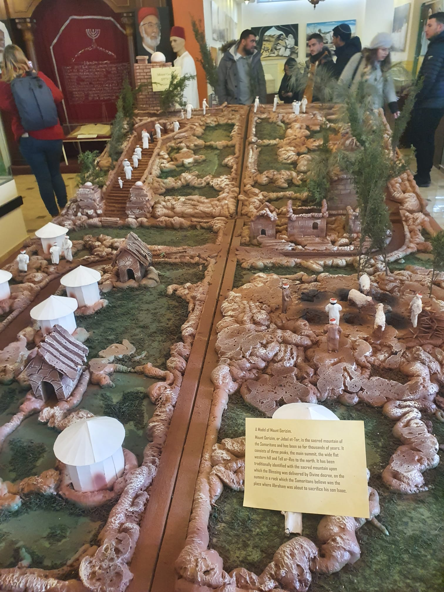
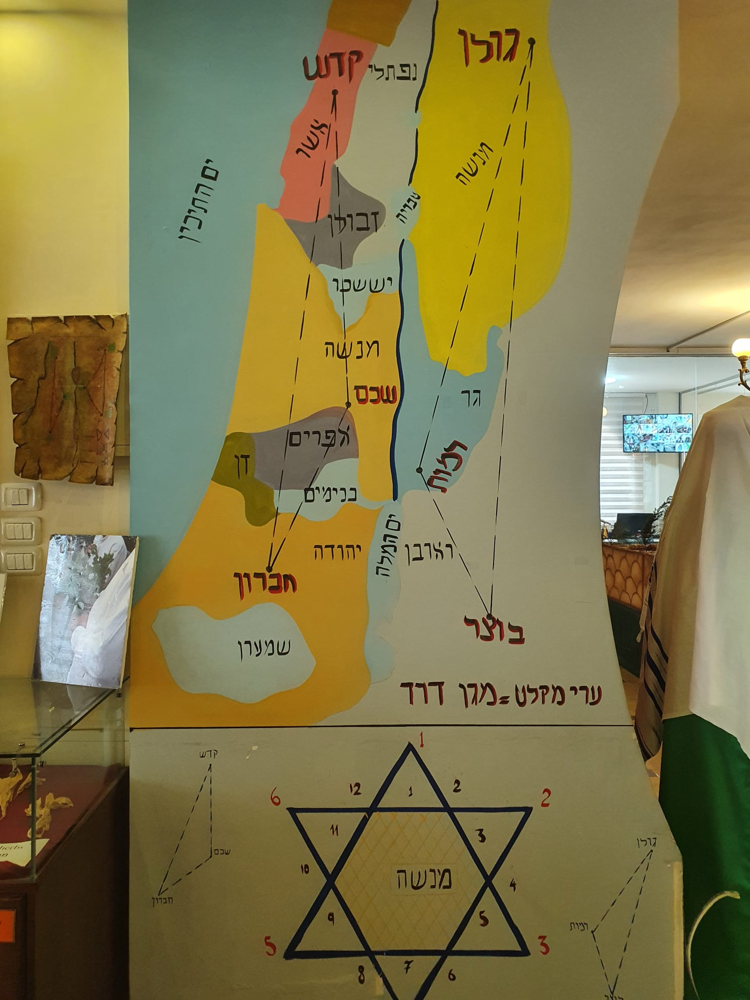

# עבודה במורשת

בעבודה זו יהיו בלה בלה בלה – לרשום את זה לאחר סיום המטלה 
לאחד את כל הרעיונות והדברים שיהיו במטלה 
להציג את זה בצורה יפה שתראה כהקדמה 

כדי להבין מעבר לנלמד בסיור החלטתי לעשות תחקיר קטן משלי.
 - מה שייכתב בחלק זה ובשאר החלקים של המטלה יכיל מידע שרכשתי מהסיור וחיזוקים מאתרים באינטרנט (כל המקורות שמהם שיתפתי מידע יצוינו בסוף המטלה)
 - עוד חשוב לי להדגיש שבחלק מן הפסקאות אני כותבת את דעתי והבנתי מהנאמר (בסיור/ממקורות המידע) ולא הוכחות כתובות.

 

  
במהלך הסיור הגענו למוזיאון מקסים שמנוהל על ידי הכהן יפת בן אשר.

בהיותי דתייה יהודייה המאמינה כי הקב"ה בחר בנו כעם הנבחר לעיתים קשה לי להכיל אמונות של אנשים אחרים.  
ומחוסר הבנה וידע על דת זו השוויתי אותה לדת הרפורמים.  
כשהגענו למוזיאון השומרונים, כצפוי לי, הרגשתי שאני פוגעת בכבוד ה' בעצם זה שאני נכנסת מבעד לדלתות המוזיאון.  
לאחר כמה רגעים שבהם חוויתי קונפליקט עם עצמי החלטתי להיכנס, לשמוע את הנאמר ולספוג תרבות שהיא אחרת משלי.    
בחרתי לספר זאת מכיוון שלרגע הזה היה משמעות גדולה עבורי, הבנתי שהאמונה שלי היא שלי ובחירה לשמוע אמונות, דעות וסיפורים של אנשים השונים ממני לא תבטל את האמון שלי בהקב"ה אלא ההפך רק תתחזק. 

לכן בחרתי לעשות את העבודה שלי על דת השומרונים.    
לאחר ששמעתי את דבריו של יפת התגבשה אצלי המחשבה שבעצם השומרונים והיהודים לא כאלה שונים,     
הם לקחו את המצוות שציווה אותנו הקב"ה והחמירו אותן, ובעצם לא הבנתי למה הם גם לא נקראים יהודים שהרי בעיניי באותו הזמן ההבדל היחיד שיכולתי לשים עליו את האצבע הוא שאנחנו היהודים מאמינים בירושלים והם השומרונים מאמינים בהר גריזים.    

 

כמובן שטעיתי.

כשניגשתי לכתיבת עבודה זו, הבנתי שאני צריכה חיזוקים בכל הנוגע לידע שלי על הנושא,    
מי הם בעצם שומרונים? ממתי וכיצד התפתחה דת זו? ועוד

לפני שנצלול עמוק לתוך תחקיר השומרונים תחילה נבין מאיפה הם הגיעו, מהי ההיסטוריה שלהם.

ניסיתי לרענן את זכרוני בכל הנאמר באוטובוס הסיור על השומרונים והינה הממצאים שהגעתי אליהם מתוך כמה מקורות מידע:

באתר הראשון שבו ביקרתי "הקהילה השומרונית בישראל" נתקלתי בטקסט שנורא עניין אותי –    
"הקהילה השומרונית היא נצר לבני ישראל מתקופת המדבר.     
השומרונים משתייכים לשבטים אפרים, מנשה ולוי.     
השם שומרונים נובע מהתיישבותם בשומרון, כשם שהמונח 'יהודים' נובע מהתיישבות ממלכת יהודה – ביהודה.    
השומרונים ידועים כשומרי הדת והתרבות העתיקה של עם ישראל.     
כותבים בכתב שונה מהיום, הכתב העברי הקדום;     
מתפללים בלשון ובמבטא העברי העתיק אשר היה שגור גם בפי אחיהם היהודים עד המאה השנייה לספירה;     
ואמונים על נוסח התורה הקדום ומסורת עתיקת יומין מבריאת העולם ועד לימינו אלה."  
כמה מהמילים שבטקסט זה הזכירו לי את יפת, הכהן שבבעלותו המוזיאון שבו ביקרנו בסיור.     
גם שם יפת השתמש הרבה במונחים שגורמים לשומע או הקורא לעשות חיבור בין השומרונים ליהודים, שכן הרעיון הכללי הוא שאנו אחים שהתפצלו עוד מזמנים קדומים יותר.  
כאן עלתה לי השאלה וההבנה:   
מהבנתי מדבריו של יפת ומהנאמר בטקסט לשומרונים יש את האמונה שהם ואנחנו היהודים באים מאותה שושלת – בני ישראל  
לאחר שקראתי טקסט זה הבנתי את הטעות הראשונה שלי,  
השומרונים לא לקחו את המצוות שציווה אותנו הקב"ה והחמירו אותן, הם רק ממשיכים במסורת העתיקה שליוותה את כולנו בימים ההם, וכך הם חיים את חייהם.  
בזמן זה של התחקיר כבר עלו לי יותר מידי שאלות, כל המקורות בלבלו אותי וההפך ממה שהיה אמור לקרות קרה,   
במקום לקבל תשובות ולהבין טוב יותר הסימן שאלה רק הלך וגדל.  
הבנתי שניסיתי לעשות הקבלה בין שתי הדתות, ניסיתי להבין יותר מידי דברים בזמן קצר מידי,     
התפתחות של המון שנים אחורה, סיבות של למה, איך ומתי   
אז אתחיל מההתחלה:  
מי אתם השומרונים?  
מאיפה וממתי התפתחה דת זו?  
סיבת הפילוג בין השומרונים ליהודים באופן אירוני מפולג לשתי דעות על פי אתר "הקהילה השומרונית בישראל".  
דעת היהדות:  
לפי מקורות המקרא ביהדות הפילוג נוצר בזמן בית שני וקרה בעקבות סירובם של היהודים לבקשת השומרונים להקים ביחד איתם את בית המקדש,  
סיבת הסירוב הייתה כי השומרונים אינם משתייכים לבני ישראל   
ומאותו הזמן חל הקרע שגרם לשומרונים ליצור העתק של בית המקדש בראש הר גריזים.  
דעת השומרונים:  
השומרונים טוענים שהם המשך ישיר של בני ישראל.     
לעומת הדעה הראשונה השומרונים טוענים שהפילוג קרה עוד קודם לכן ונוצר בעקבות נטישת עלי הכהן את הר גריזים ובחירתו להקים משכן בשילה   
טענתם היא שכל זה קרה מכיוון שעזי בן בקי משושלת פנחס היה אמור לרשת את הכהונה הגדולה מאבין,  
שכן היא הובטחה לזרע פנחס לעולמים, וכך נוצרו להם שני המשכנים   
גרעין הסכסוך לדעתם נשאר בעינו במקום הנבחר – ירושלים והר גריזים.  
בכמה ממקורות אחרים שעיינתי בהם לצורך עבודה זו, טוענים ששם השומרונים נגזר מלשון שמרתם על התורה מקורית והטהורה, בניגוד לטענה שהשם נובע מהתיישבותם בשומרון  
מתוך המקור:  
השומרונים מעדיפים להיקרא "ישראלים שומרים".  
שומרים על חוקיהם, על מסורתם, על שפתם – עברית עתיקה ועל מנהגיהם.  
פיוטיהם נאמרים בארמית בניב שומרוני.   
את מצוות התורה הם שומרים בצורתן הקדומה:  
שבת ללא חימום וכמעט ללא תאורה,  
מנהגי טומאה וטהרה מחמירים,  
לוח שנה קדום - שנת ירח,   
צורת פולחן שלא השתנתה אלפי שנים - זבח הפסח על הר גריזים.  

ועדיין יש המון הבדלים בין האמונות של שני העמים  
הטעות השנייה שלי היא שבהתחלה חשבתי שקיים רק הבדל אחד והוא האמונה במקום הקדוש  
אומנם זהו ההבדל העיקרי אך קיימים עוד המון הבדלים מהותיים.  
לפי מה שהיה זכור לי מדבריו של יפת השומרונים מאמינים אך ורק בתורה שבכתב, ומקיימים אותה כלשונה.   
קיימים הבדלים בין התורה שבה הם מאמינים לתורה שאנו היהודים מאמינים  
לפי האתר שמרבית מהמידע נלקח ממנו לשומרונים יש חמישה עיקרי אמונה שבהם הם מאמינים:  
החמישה מתוך האתר:   

1.	אל אחד, אלוהי אברהם יצחק ויעקב.
2.	נביא אחד, משה בן-עמרם. הנביא האחרון בכרוניקה השומרונית. אחריו כולם מנהיגים ולא נביאים.
3.	תורת משה, חמשת חומשי תורה בלבד (אצל השומרונים הנוסח שונה במעט).
4.	מקום קדוש – הר-גריזים. הוא המקום הנבחר והקדוש ביותר לקהילה.
5.	יום אחרית הימים – יום תשלום לרשעים ושכר לצדיקים (נקם ושלם).

כדי לבחון מעט יותר לעומק על ההבדלים בין התורה שלהם לתורה שלנו נעזרתי בויקיפדיה, "אמונה ומנהגים"
הספר הקדוש היחיד לדעת השומרונים הוא תורת משה שהוכתב למשה רבינו ( אצלם נקרא- משה בן עמרם)
גם לפי המקור כתוב שהעותק שבו הם מאמינים שונה מהעותק שאנו היהודים מאמינים
ושהשינוי העיקרי הוא בעשרת הדיברות, בדיבר העשירי אצלם מופיעה פרשה הקשורה בבניית המזבח בהר גריזים
לפי אמונתם התורה נבראה לפני בריאת העולם ומי שעוסק בתורה זו מובטח לו חלק בעולם הבא.
מועדים:
השומרונים חוגגים רק את חגי התורה בלבד שבכללם: 
חג הפסח
חג המצות
חג השבועות
ראש החודש השביעי
יום כיפור
חג הסוכות 
שמיני עצרת 

שבת:
יום השבת הוא היום החשוב ביותר אצל השומרונים 
במקור אחר קראתי שאף יותר מיום הכיפורים 
השומרונים שומרים את השבת לפי הפסוק -"לא תבעירו אש בכל מושבותיכם ביום השבת"
לפני השבת אנשי הדת מנתקים את כל מוצרי החשמל של הבית, 
במהלך השהות במוזיאון בחלק של שאלות קהל, שאל סטודנט את יפת האם הם מנתקים את כל מוצרי החשמל ובכללם הפלטה חשמלית שאנו היהודים נוהגים להשתמש, שכן לפי דת היהודים אפשר להשתמש במכשיר חשמלי אשר הודלק/הופעל לפני שבת 
באותו זמן נדהמתי מתשובתו- אכן גם בפלטה אינם משתמשים ואין יוצא מן הכלל, כל מוצר חשמלי הוא אסור כולל מקרר ומזגן 
את האוכל הם אוכלים קר ובעיקרון חייהם ממש מזכירים את החיים שחיו האנשים בעבר לפני שהטכנולוגיה נכנסה לחיינו 
אך גם אצלם יש יוצא מן הכלל, לפי הפסוקים- "לפני עיוור לא תיתן מכשול" ו-"פיקוח נפש דוחה שבת".
לפי הפסוק הראשון הותר לשומרונים להשאיר אור דולק בחדרי אוכל ובעוד מקומות שאור יהיה להם נחוץ.
לפי הבא במקרה של מקרה חירום הותר להם להשתמש בטלפון על מנת להזעיק עזרה רפואית ואף לנסוע ברכב אל בית חולים במקרה הצורך.

כאמור חייהם נותרו כחיי תקופות קדומות יותר ולכן עוד עניין אותי לבחון את מעמד האישה בדת השומרונית 
המידע שזכרתי מהמוזיאון הוא שהאוכלוסייה השומרונית מדללת מהסיבה שאין הרבה נשים 
כדי למנוע זאת הם מקבלים לדתם נשים מכל העולם המעוניינות לחיות את חייהן כשומרונים 
מסיפורי יפת עולה כי נשותיהן חיות כחיי מלכה
במהלך נידתה אסור לאישה לבוא במגע עם אף חפץ או אדם ואף עליה להודיע שהיא בנידה כדי שאנשים אחרים ימנעו מלבוא במגע איתה 
קיימים עבורה חפצים המיועדים בדיוק לימים אלו ועל מנת להקל על האישה את ימי נידתה הנשים האחרות עוזרות ומבשלות לה ולמשפחתה ואף עוזרות בניקיון הבית 
אך לא רק הן, גם בעלי הבית והילדים עוזרים וכך מתחלקים בניהם במטלות 
גם אחרי לידה האישה חייבת לשמור טומאת נידה לפי כללים מורחבים יותר:
בהסתמך על הכתוב בספר ויקר. כאשר האישה יולדת בן עליה לשמור 40 ימי טומאה - 7 ימי נידה ועוד 33 ימי טומאה בדרגה מופחתת יותר, וכאשר יולדת בת, עליה לשמור 80 ימי טומאה - 14 ימי נידה ועוד 66 ימי טומאה בדרגה מופחתת יותר.
לנשים השומרוניות אין לבוש מיוחד הן רשאיות להתלבש לפי טעמן אך נמנעות מלבישת מכנסיים ביום השבת.
